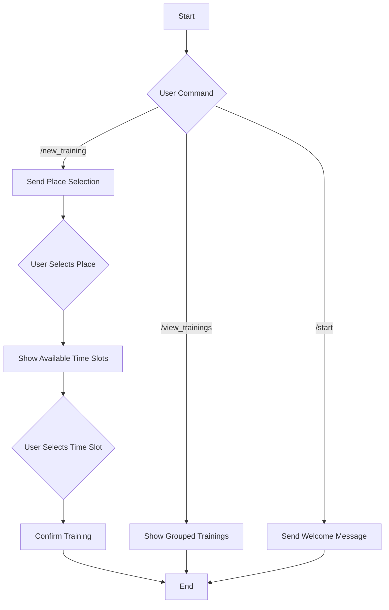

# tennis-tg-bot 🏓

[![[branch]](https://github.com/tubopo/tennis-tg-bot/actions/workflows/branch.yml/badge.svg)](https://github.com/tubopo/tennis-tg-bot/actions/workflows/branch.yml)
[](https://goreportcard.com/report/github.com/tubopo/tennis-tg-bot)
[](https://github.com/tubopo/tennis-tg-bot/blob/main/LICENSE)

Welcome to the coolest way to schedule your tennis training sessions! This bot is like having a personal assistant who's really into tennis and really good at scheduling. It's perfect for those who love to hit the ball but hate to hit the books (or calendars).

## 🚀 Features

- 🏟️ Choose your preferred training location
- 🕰️ Pick a time slot that fits your busy "pro athlete" schedule
- 🏆 Select your skill level (we won't judge, promise!)
- 📅 Automatically schedules for the current date (because who plans ahead anyway?)
- 👥 View all scheduled trainings

## 🏓 How It Works

Here's a flowchart to show you how this bot operates. It's almost as smooth as your backhand!


```mermaid
graph TD
    A[Start] --> B{User Command}
    B -->|/start| C[Send Welcome Message]
    B -->|/new_training| D[Send Place Selection]
    B -->|/view_trainings| E[Show Grouped Trainings]
    D --> F{User Selects Place}
    F --> G[Show Available Time Slots]
    G --> H{User Selects Time Slot}
    H --> I[Confirm Training]
    I --> J[End]
    E --> J
    C --> J
```

## 🎮 Commands

- `/start` - Wake up the bot (it's always ready, unlike some of us before coffee)
- `/new_training` - Start scheduling your next victory... err, training session
- `/view_trainings` - View all scheduled training sessions

## 🤖 Try It Out

Want to see the bot in action? Serve up a conversation with our sample bot:

👉 [MSQ Tennis Bot](https://t.me/msq_tennis_bot) 👈

Give it a swing and see how easy scheduling can be!

## 🏗️ Setup

Clone this repo, set up your TG_BOT_TOKEN environment variable (it's like the secret sauce of our bot burger). Run the bot and start scheduling!

## 🐳 Docker

Yes, we've containerized our bot! It's like putting a tennis ball machine in a really efficient box.

To run:

```bash
docker-compose up -d
```

## 👩‍💻 Development

Feel free to contribute! Whether it's adding new features, fixing bugs, or just adding more tennis puns to this README. We love Pull Requests almost as much as we love a good serve!

## 📜 License

This project is licensed under the MIT License - see the LICENSE file for details. It's as open as an unguarded court!

## 🎾 Final Thoughts

Remember, in tennis and in coding: love means nothing. But we still love this bot, and we hope you do too!

Now go forth and schedule those training sessions! May your code be as clean as your court, and your commits as precise as your serves! 🚀🎾
