# tennis-tg-bot 🏓

[![[branch]](https://github.com/tubopo/tennis-tg-bot/actions/workflows/branch.yml/badge.svg)](https://github.com/tubopo/tennis-tg-bot/actions/workflows/branch.yml)

## schedule user flow

```mermaid
---
       title: Trainning schedule user flow
---
flowchart TD
    start([Записаться на тернировку])
    start-->date[Выбрать дату]
    start-->place[Выбрать зал]

    date--"`Avalible Time Slots`"-->calendar[place, dd-mm-yy, hh:mm]

    place-->date
```

